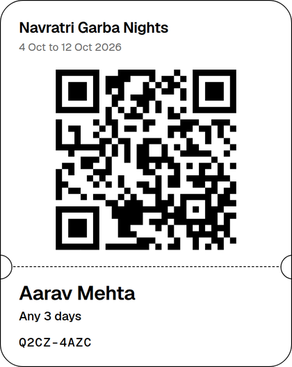
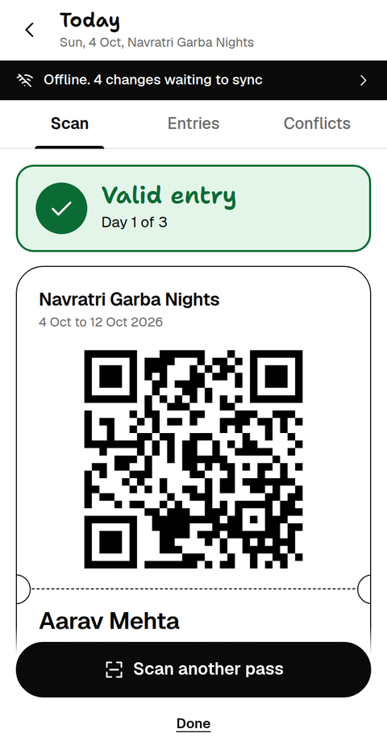
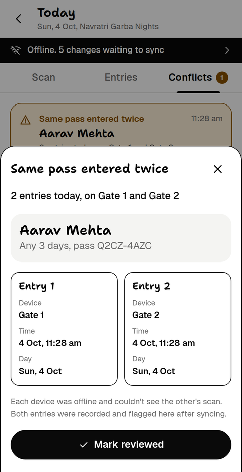

<div align="center">


# Stub

### Entry passes that keep working when the network doesn't.

Scan QR passes at the gate with zero signal. Every phone syncs later,<br>
and a pass used twice gets caught instead of silently accepted.

**[Open the live app](https://cudios.github.io/stub/)** &nbsp;|&nbsp; [Documentation](docs/DOCUMENTATION.md) &nbsp;|&nbsp; [Test checklist](docs/testing.md)

<br>

&nbsp;&nbsp;
&nbsp;&nbsp;


<sub>An entry pass &nbsp;|&nbsp; a valid scan with no internet &nbsp;|&nbsp; the same pass caught at two gates</sub>

</div>

## The problem

Picture this: Ten thousand people. And there's zero signal.

Most events still check entries one of two ways:
1. **Paper tickets**, which are easy to fake and hard to track. Or,
2. **dedicated scanning machines**, which are expensive and often get stuck the moment the signal drops.

Either way, the queue stops and everyone waits.

## Meet Stub...

Stub turns **any phone into an entry scanner.** 

1. **Create an event.** You get two codes, one for organizers and one for gate staff.
2. **Add attendees.** Each one gets a QR pass to download or share.
3. **Scan at the gate.** Green or red in about a second, online or offline!
4. **Reconnect.** Every phone syncs up and flags anything fishy, side by side.

Need another pass scanner? Just hand someone the volunteer code. That's it!

## Why it's different

- **It never waits for the internet.** Every phone carries its own copy of the event.
- **It never loses a scan.** Records are only ever added, never overwritten.
- **It never hides a problem.** Same pass at two gates? A pass used more days than allowed? A cancelled pass let in? The moment phones reconnect, Stub catches it.

## Under the hood

| Choice | Why |
|---|---|
| Installable web app | Runs in any phone browser, with nothing to download from an app store |
| Firestore with offline cache | Handles the queue and syncing, so the app can focus on rules and conflicts |
| Append-only records | Overwrites simply can't happen, and the database rules enforce it |

Curious about the details? It's all in the [documentation](docs/DOCUMENTATION.md#key-technical-decisions).

## Try it in two minutes

1. Open the [live app](https://cudios.github.io/stub/) on two devices. Create an event on one and join with the volunteer code on the other.
2. Add an attendee and download their pass.
3. Turn **both devices offline** and scan the same pass on each. Both say valid, because neither can see the other.
4. Turn them back **online**. A conflict alert appears with both entries side by side.

## Testing

```bash
npm test
```

16 unit tests cover the pass rules and the conflict detector. Real-device scenarios, including offline reloads and two-device conflicts, are in the [test checklist](docs/testing.md).

## Known limitations

- Day boundaries and "latest edit" rely on each device's clock.
- Event codes are the only access control. Real sign-in is on the roadmap.
- With re-entry on and no exit scanning, a shared pass looks like a re-entry.
- A device needs internet once to join an event.

The full list and roadmap are in the [documentation](docs/DOCUMENTATION.md#known-limitations).

## Run your own copy

1. Create a free Firebase project with a Firestore database and publish [`firestore.rules`](firestore.rules).
2. Paste your web config into [`src/config/firebase-config.js`](src/config/firebase-config.js).
3. Run `npm run serve`, or deploy the folder to GitHub Pages.

Step-by-step setup is in the [documentation](docs/DOCUMENTATION.md#run-it-yourself).

## Built with

Cloud Firestore, qrcode-generator, jsQR, and the Geist and Shantell Sans fonts. No external datasets. The code was written with AI assistance. The idea, requirements, design decisions and device testing were mine.

<div align="center"><sub>Released under the Apache License 2.0</sub></div>
