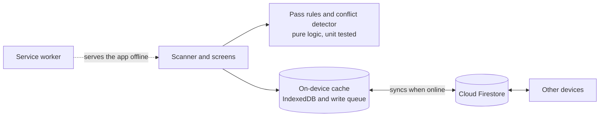

<div align="center">


# Stub

### Entry passes that keep working when the network doesn't.

Scan QR passes at the gate with zero signal. Every phone syncs later,<br>
and a pass used twice gets caught instead of silently accepted.

**[Open the live app](https://cudios.github.io/stub/)** &nbsp;|&nbsp; [Documentation](docs/DOCUMENTATION.md) &nbsp;|&nbsp; [Test checklist](docs/testing.md)

<br>

&nbsp;&nbsp;
&nbsp;&nbsp;


<sub>An entry pass &nbsp;|&nbsp; a valid scan with no internet &nbsp;|&nbsp; the same pass caught at two gates</sub>

</div>

## The problem

Put ten thousand people in one ground and the mobile network gives up. Entry apps that ask a server about every ticket freeze right when the queue is longest. Paper lists never freeze, but they can't tell you that the same pass just walked in through the other gate.

## How it works

| Step | What happens |
|---|---|
| **Create** | Make an event and get a manager code and a volunteer code. No accounts. |
| **Issue** | Add attendees with an *Any X days* or *Fixed days* pass, optional re-entry. Download or share each pass. |
| **Scan** | Point the camera at a pass. Green or red, with the reason, online or not. |
| **Sync** | Scans queue on the device and upload by themselves when the signal returns. |
| **Catch** | Every device cross-checks the merged history and flags misuse, side by side. |

## What makes it different

- **The gate never waits for a server.** Each device checks passes against its own copy of the event.
- **Nothing is ever overwritten.** Scans and edits are only ever added as new records, so a late sync can't erase another device's work.
- **Every device agrees on conflicts.** The same check runs everywhere over the same history, so no device has to be in charge.
- **Honest about offline.** A phone without signal only knows its own scans. Stub doesn't pretend otherwise and catches cross-device misuse the moment devices reconnect.

## What it catches

| Conflict | Example |
|---|---|
| Same pass entered twice | Two offline gates both let one pass in |
| More days used than allowed | A 1-day pass used on two days at different gates |
| Cancelled pass let in | The organizer cancels a pass while a gate admits it offline |
| Conflicting edits | Two managers rename the same attendee offline. The latest wins and the other version stays visible |

## Architecture



| Decision | Why |
|---|---|
| Installable PWA, no build step | Runs in any phone browser, and the repo is exactly what gets deployed |
| Firestore with its offline cache | A reliable queue, retries and realtime sync, so the app's own code can focus on rules and conflicts |
| Append-only records | Silent overwrites are impossible by design, and the database rules enforce it |
| Conflicts computed, not stored | Every device reaches the same answer without coordinating |
| Native QR reader with a fallback | Fast on Android Chrome, still works with laptop webcams |

The reasoning behind each choice is in the [documentation](docs/DOCUMENTATION.md#key-technical-decisions).

## Try it in two minutes

1. Open the [live app](https://cudios.github.io/stub/) on two devices. Create an event on one and join with the volunteer code on the other.
2. Add an attendee and download their pass.
3. Turn **both devices offline** and scan the same pass on each. Both say valid, because neither can see the other.
4. Turn them back **online**. A conflict alert appears with both entries side by side.

## Testing

```bash
npm test
```

16 unit tests cover the pass rules and the conflict detector. Real-device scenarios, including offline reloads and two-device conflicts, are in the [test checklist](docs/testing.md).

## Known limitations

- Day boundaries and "latest edit" rely on each device's clock.
- Event codes are the only access control. Real sign-in is on the roadmap.
- With re-entry on and no exit scanning, a shared pass looks like a re-entry.
- A device needs internet once to join an event.

The full list and roadmap are in the [documentation](docs/DOCUMENTATION.md#known-limitations).

## Run your own copy

1. Create a free Firebase project with a Firestore database and publish [`firestore.rules`](firestore.rules).
2. Paste your web config into [`src/config/firebase-config.js`](src/config/firebase-config.js).
3. Run `npm run serve`, or deploy the folder to GitHub Pages.

Step-by-step setup is in the [documentation](docs/DOCUMENTATION.md#run-it-yourself).

## Built with

Cloud Firestore, qrcode-generator, jsQR, and the Geist and Shantell Sans fonts. No external datasets. The code was written with AI assistance (Claude, by Anthropic). The idea, requirements, design decisions and device testing are the author's.

<div align="center"><sub>Released under the Apache License 2.0</sub></div>
