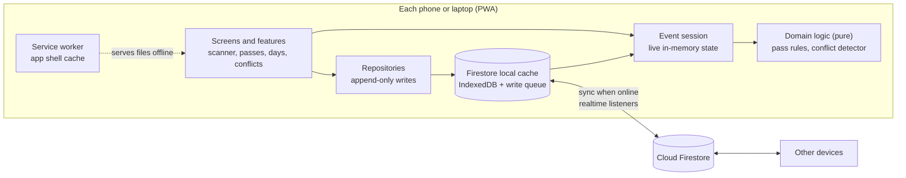

# Stub

**Offline-first entry passes for multi-day events.**

Stub lets an organizer create an event, issue QR passes, and scan them at the entrance from any phone or laptop, even with zero network. Every device keeps working offline, queues what it does, syncs when the signal returns, and cross-checks the other devices so that a pass used twice is flagged instead of silently accepted.

It is built for the places where mobile data dies first: crowded festival grounds, concerts, campus fests, conferences in basements, and any event that runs for several days.

## Contents

- [Why](#why)
- [Features](#features)
- [How it works](#how-it-works)
- [Architecture](#architecture)
- [Key technical decisions](#key-technical-decisions)
- [Data model](#data-model)
- [Pass rules](#pass-rules)
- [Conflict handling](#conflict-handling)
- [Try it in two minutes](#try-it-in-two-minutes)
- [Run it yourself](#run-it-yourself)
- [Project structure](#project-structure)
- [Testing](#testing)
- [Edge cases handled](#edge-cases-handled)
- [Known limitations](#known-limitations)
- [Roadmap](#roadmap)
- [Privacy](#privacy)
- [Third-party services and AI assistance](#third-party-services-and-ai-assistance)
- [License](#license)

## Why

Thousands of people in one place overload the nearest cell towers. Entry systems that check every pass against a server stall exactly when the queue is longest. Paper lists don't stall, but they can't tell you that the same pass was just used at the other gate.

Stub keeps the gate moving with no network and still catches misuse later. Each device validates passes against its own local copy of the event. When devices reconnect, their scan histories merge and anything that only one device could not have known about, such as two gates admitting the same pass, is surfaced as a conflict for a person to review.

## Features

**Organizers (manager code)**
- Create an event with a name, description and date range. No accounts, no passwords.
- Receive two six-character codes: a manager code and a volunteer code.
- Add attendees with a name and optional phone number, then pick a pass type:
  - **Any X days**: usable on any X days of the event.
  - **Fixed days**: usable only on chosen dates. Selecting every day makes a full-event pass.
  - Optional **re-entry** on the same day.
- Each attendee gets a ticket-style pass with a QR code that can be downloaded as an image or shared straight to a messaging app.
- Edit attendee details or cancel a pass, online or offline.
- Control volunteer permissions: undoing scans and seeing phone numbers.

**Gate staff (volunteer code)**
- Tap **Scan pass**, point the camera at the QR, get a full-colour result with the reason.
- **Scan another pass** in one tap. Pass IDs can also be typed if a QR is damaged.
- Undo a mistaken entry when permitted.

**Everyone**
- A sync bar that is always visible: online or offline, and how many changes are waiting to upload.
- A day-by-day timeline. Past days keep their full entry log; today opens the scanner.
- A **Conflicts** tab with side-by-side comparisons and a **Mark reviewed** action. Conflicts belong to the day they happened on.
- Installable to the home screen and fully usable offline after the first load.

## How it works

1. **First load (online):** the app shell is cached by a service worker, and the event's data is cached in IndexedDB by the Firestore client.
2. **At the gate (offline or online):** a scan reads the pass ID from the QR, looks it up in the local cache, applies the pass rules against the scans this device knows about, and records the result. The record is written locally first and queued for upload.
3. **Sync:** whenever a connection exists, queued records upload automatically and records from other devices stream in through realtime listeners.
4. **Cross-check:** after every change, a pure conflict detector re-reads the full merged history and reports anything that breaks a rule. New conflicts raise an alert on every open device.

If a device is online while scanning, it already has every other device's scans, so a duplicate is rejected on the spot. If it is offline, it can only know its own scans; that gap is exactly what the conflict detector closes after sync.

## Architecture



| Layer | Folder | Responsibility |
|---|---|---|
| Domain | `src/domain` | Pure functions with no browser or database code: dates, IDs, pass rules, attendee folding, conflict detection, permissions. Fully unit-tested. |
| Data | `src/data` | Firestore references, append-only repositories and the live `EventSession` that turns snapshots into one state object. |
| Core | `src/core` | Firebase setup, hash router, local device storage, connectivity watch, PWA install and service worker registration. |
| UI kit | `src/ui` | Small DOM helper, icons, sheets, toasts, form controls, tabs, sync status bar, sounds. |
| Features | `src/features` | Scanner, passes, entries log, conflicts, event settings. |
| Screens | `src/screens` | Route-level screens composed from features. |

## Key technical decisions

| Decision | Why |
|---|---|
| **PWA with no build step** | Plain ES modules run directly in the browser. The repository is exactly what gets deployed, and every file can be read as-is. |
| **Cloud Firestore with persistent local cache** | Provides the offline cache, the write queue, retry, and realtime sync across devices, which are the plumbing of an offline-first app. Stub adds the rules, conflict detection and sync visibility on top. |
| **Append-only records** | Scans and edits are always new documents and are never overwritten. Firestore's default last-write-wins behaviour therefore never gets a chance to destroy information. The only in-place change is marking a scan as undone, and the security rules allow nothing else. |
| **Conflicts are computed, not stored** | Every device runs the same deterministic detector over the same merged history, so all devices agree on the conflict list without coordinating. Only "reviewed" marks are stored. |
| **Pass rules locked after creation** | Removes the hardest kind of conflict entirely. Changing rules means cancelling and reissuing the pass. |
| **Edits keep their base** | Every edit records which version it was made on top of. Two edits built on the same base were made without seeing each other, which is the precise definition of a conflicting edit. |
| **Codes instead of accounts** | Gate staff join in seconds with no sign-up. Separate manager and volunteer codes give two roles. |
| **Native QR reading with a fallback** | Uses the browser's built-in `BarcodeDetector` where available (Chrome on Android) and falls back to jsQR elsewhere, such as desktop webcams. |
| **Network-first service worker with a timeout** | Fresh files when the network works, cached files instantly when it doesn't, and a 3.5 second cut-off for weak "connected but not really" signal. |
| **Vendored libraries and fonts** | Everything the app needs is served from its own origin and cached, so nothing breaks when a CDN is unreachable. |

## Data model

```
codes/{CODE}                      { eventId, role: "manager" | "volunteer" }
events/{eventId}                  { name, description, startDate, endDate, createdAt, settings }
events/{eventId}/private/codes    { managerCode, volunteerCode }
events/{eventId}/attendees/{passId}  { passId, name, phone, rule, allowReentry, createdAt }   immutable
events/{eventId}/edits/{id}          { passId, field, value, baseEditId, editedAt, deviceName } append-only
events/{eventId}/scans/{id}          { passId, day, at, deviceName, status, reason, undone }    append-only
events/{eventId}/reviews/{id}        { conflictId, reviewedAt, reviewedBy }
```

The current attendee shown in the app is the original record with its edits applied in time order. Cancelling a pass is an edit of the `deleted` field, so history is never lost.

QR codes contain only `STUB1.<eventId>.<passId>`. Pass IDs are random, so valid passes cannot be guessed.

## Pass rules

A scan on a given day is checked in this order:

| Check | Result |
|---|---|
| Pass not found on this device | Unknown pass |
| Pass belongs to another event | Wrong event |
| Pass was cancelled | Pass cancelled |
| Today is outside the event dates | No event today |
| Fixed-days pass, today not included | Not valid today (lists the valid days) |
| Already entered today, re-entry off | Already entered today (time and device of first entry) |
| Already entered today, re-entry on | Valid re-entry |
| Any-days pass with all days used | All days used |
| Otherwise | Valid entry, day N of X |

A day is the calendar day on the scanning device. Rejected scans are recorded too, so the log shows attempts as well as entries.

## Conflict handling

| Conflict | Detected when | Shown as |
|---|---|---|
| **Same pass entered twice** | More than one live entry for a pass on one day, and re-entry is off | Each entry side by side with device and time |
| **More days used than allowed** | An any-days pass has entries on more distinct days than allowed | One column per day used |
| **Cancelled pass let in** | An entry was recorded after the pass was cancelled elsewhere | The cancellation next to the entry |
| **Conflicting edits** | Two edits to the same field were made from the same starting version | Every version side by side, with the kept one marked |

For edits, the most recent edit by edit time is shown everywhere, and the other versions stay visible in the conflict card, so nothing is overwritten silently. Undoing one of two duplicate entries resolves that conflict automatically. **Mark reviewed** moves a conflict into the Reviewed list on every device.

## Try it in two minutes

You need two devices, or one laptop with a normal window and a private window.

1. **Device A:** open the app, tap **Create event**, give it today's date, and note the two codes.
2. **Device A:** in **Manage**, add an attendee with an "Any 1 day" pass and download the pass image. Show it on a screen or print it.
3. **Device B:** tap **Enter a code** and enter the volunteer code.
4. Turn **both devices offline** (airplane mode or Wi-Fi off). The sync bar turns black.
5. On both devices go to **Days → Today → Scan pass** and scan the same pass. Both show a green result, because neither can see the other.
6. Scan it again on one device. It is rejected as already entered.
7. Turn both devices **back online**. The pending count drains to zero, a conflict alert appears, and **Conflicts** shows both entries side by side.

To see an edit conflict, edit the same attendee's name on two offline manager devices and reconnect.

## Run it yourself

### 1. Firebase (free tier, no card needed)

1. Create a project at [console.firebase.google.com](https://console.firebase.google.com). Analytics can be off.
2. **Build → Firestore Database → Create database.** Pick a nearby location and start in production mode.
3. Open the **Rules** tab, paste the contents of [`firestore.rules`](firestore.rules), and **Publish**.
4. **Project settings → General → Your apps → Web (`</>`)**, register an app (no hosting needed), and copy the `firebaseConfig` values.
5. Paste them into [`src/config/firebase-config.js`](src/config/firebase-config.js). These values identify the project; they are not secrets.

### 2. Run locally

Service workers and ES modules need a local web server, not a double-clicked file.

```bash
npm run serve
```

Then open http://localhost:5173. The camera works on `localhost`; on other devices it needs HTTPS.

### 3. Deploy to GitHub Pages

1. Push the repository to GitHub.
2. **Settings → Pages → Build and deployment → Deploy from a branch**, choose `main` and `/ (root)`.
3. The app is served at `https://<user>.github.io/<repo>/` over HTTPS, which the camera requires.

After changing files, run `npm run precache` so the service worker's file list and version are refreshed.

## Project structure

```
.
├── index.html               App shell
├── manifest.webmanifest     Install metadata
├── sw.js                    Service worker (generated file list)
├── firestore.rules          Database security rules
├── assets/                  Icons and fonts
├── styles/                  tokens, base, components, pass, scanner, screens
├── vendor/                  Pre-bundled Firebase, QR generator, jsQR
├── scripts/precache.mjs     Rebuilds the service worker file list
├── tests/                   Unit tests for the domain layer
├── docs/testing.md          Manual test checklist
└── src/
    ├── main.js              Entry point and routes
    ├── config/              Firebase project config
    ├── core/                firebase, router, store, connectivity, bus, pwa
    ├── domain/              dates, ids, pass-rules, attendees, conflicts, permissions
    ├── data/                refs, repositories, event-session
    ├── ui/                  dom, icons, sheet, toast, fields, tabs, sync-status
    ├── features/            scanner, passes, entries, conflicts, events
    └── screens/             home, create, join, event, day, setup
```

## Testing

**Automated:** the pass rules and conflict detector are pure functions with unit tests.

```bash
npm test
```

They cover unknown and cancelled passes, out-of-range days, any-days and fixed-days rules, re-entry, duplicate entries, undone entries, overuse across days, entries after cancellation, and conflicting versus sequential edits.

**Manual:** [`docs/testing.md`](docs/testing.md) lists the end-to-end scenarios run on real devices, including offline reloads and two-device conflicts.

## Edge cases handled

- App opened with no network after the first visit: loads from cache with all event data.
- App reloaded or closed while offline with unsynced scans: the queue is persisted and uploads later.
- Weak signal that reports "online" but cannot reach the server: shown as *Connecting*, files served from cache after a timeout.
- Pass created on one device and scanned on another that hasn't synced yet: *Unknown pass* with guidance to sync.
- Pass cancelled on one device while another admits it offline: flagged after sync.
- Same pass scanned twice on one device: rejected immediately with the first entry's time and device.
- Damaged QR: manual pass ID entry with format validation.
- QR codes from other apps or other events: rejected with a clear message.
- Camera blocked, missing or busy: specific instructions plus manual entry.
- Camera stops when the app goes to the background to save battery.
- Joining an event while offline: blocked with an explanation, since a device can't download what it has never seen.
- Long names: wrapped on screen and shrunk to fit in the downloadable pass image.

## Known limitations

- **Device clocks:** "latest edit wins" and day boundaries use each device's clock. A phone with a wrong clock can misorder edits.
- **Day boundary:** an entry after midnight counts toward the next calendar day. Late-night events may want a custom cut-off.
- **Re-entry and sharing:** with re-entry on and no exit scanning, a pass handed to someone outside looks the same as a genuine re-entry.
- **Codes are the only access control:** anyone with a code has that role. Roles are enforced in the app, not by authenticated database rules, and a technical user could read data for an event whose ID they know.
- **First join needs internet**, and sync only happens while the app is open.
- **Scale:** each device loads the whole event history. That is fine for thousands of scans; very large events would need per-day queries.
- **Desktop scanning** relies on the jsQR fallback, which is slower than the native reader on Android.

## Roadmap

- Real sign-in with Firebase Authentication and per-role security rules.
- Bulk attendee import from CSV or spreadsheet exports.
- Custom day cut-off times for events that run past midnight.
- Exit scanning for accurate occupancy and stronger anti-sharing checks.
- Block or suspend a pass directly from a conflict.
- Optional, consent-based photo capture at entry, auto-deleted after the event.
- Background sync and push alerts for organizers.
- Multi-language interface.

## Privacy

Stub stores only what an entrance needs: attendee name, an optional phone number, pass rules and the scan log with device names. Phone numbers are hidden from volunteers unless the organizer allows it. No tracking or analytics are included. Any future photo capture would be opt-in per event, shown with a clear consent notice, and deleted automatically after the event, in line with India's Digital Personal Data Protection framework.

## Third-party services and AI assistance

| Component | Use | License |
|---|---|---|
| [Firebase JS SDK](https://github.com/firebase/firebase-js-sdk) (Cloud Firestore) | Database, offline cache and sync | Apache-2.0 |
| [qrcode-generator](https://github.com/kazuhikoarase/qrcode-generator) | Generating pass QR codes | MIT |
| [jsQR](https://github.com/cozmo/jsQR) | QR reading where the native detector is unavailable | Apache-2.0 |
| [Geist and Geist Mono](https://vercel.com/font) | Interface and code fonts | OFL-1.1 |
| [Shantell Sans](https://shantellsans.com) | Headings and pass names | OFL-1.1 |

No external datasets are used. The code was written with AI assistance (Claude, by Anthropic). The product idea, requirements, design decisions and device testing are the author's own.

## License

[MIT](LICENSE)
